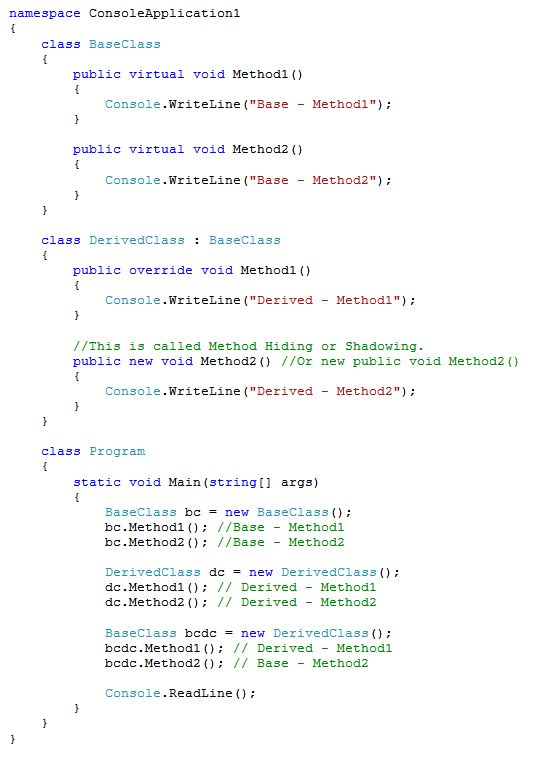

# OOPS

## Cohesion 
* In OOPs we develop our codes in modules. Each module has certain responsibilities. Cohesion shows **how much a module responsibilities are strongly related** 
* higher cohesion is always preferred: 
    * Improves maintenance of modules
    * Increases reusability 

## Coupling 
* OOPS modules are dependent on each other. Coupling refers to **level of dependency between two software modules.** 
* Two modules are highly dependent on each other if you have changed in one module and for supporting that change every time you have to change in dependent module.
* Loose Coupling is always preferred.
* Inversion of Control and dependency injections are some techniques for getting loose coupling in modules.

## Struct 
* It is a value type & Inherits from System.Value
* Usually used for smaller amounts of data
* It can not be inherited to other type 
* It can not be abstract 
* It doesn't need to be instantiated by new keyword. 


## Class
* It is reference type and inherits from System.Object
* It is used for large amounts of data
* Can be inherited to other class and can be abstract type

### Partial Class
* It is used to split definition of class in two or more classes.
* Class definition can be created in multiple files which will be compiled as one class at run time and also when you'll create instance of this class.
* These classes should be created in the same namespace. 
* You can use “partial” keyword with all the class name which you want to bind together with the same name of class in same namespace.
```
    // EmployeeProps.cs
    
    public partial class Employee
    {
        public int EmpId { get; set; }
        public string Name { get; set; }
    }
    
    // EmployeeMethods.cs
    
    public partial class Employee
    {
        //constructor
        public Employee(int id, string name){
            this.EmpId = id;
            this.Name = name;
        }

        public void DisplayEmpInfo() {
            Console.WriteLine(this.EmpId + " " this.Name);
        }
    }
```

### Abstract Class 
* This **cannot be instantiated**, This is to only act like a base class. 
* It enforces hierarchies for the sub classes. 
* other abstract classes may inherit from an abstract class. 
* An Abstract class can have non abstract methods as well. 
* **abstract keyword** can be used with class, method, properties, indexers and events. 
* Abstract members can only be declared inside abstract class. 
* An abstract members/method cannot be **static or private or virtual**
* This is used to implement **template method pattern**
* An abstract class cannot be sealed as abstract keyword required class to be inherited. 
* An abstract class can have constructors. 
* An abstract class cannot be instantiated because it is not fully implemented class as its abstract methods cannot be executed. 

### Enum 
* An enum is a special "class" that represents a group of constants (unchangeable/read-only variables).
* Enums cannot be inherited enum in c#, are default **sealed**

### Static vs Singleton Instance
* Static class cannot implement an interface but a singleton class can implement an interface. 
* Singleton object can be cloned but static class object cannot be cloned. 
* Singleton object is stored in heap but static object is stored in stack. 
* A singleton class can be initialized lazily or asynchronously while a static class is generally initialized when it is first loaded. 

### Sealed Classes 
* It is used to restrict inheritance and becomes last class in hierarchy
* It can be a derived class but cannot be the base class.
* A sealed class can not be an abstract class as with abstract keyword inheritance is required. 
* structs and enums are sealed.  
* Sealed method is used to define the overriding level of a virtual method.

 

## Interface 
* It is contract and has no implementation(until c# 9 in which an interface can have a default implementation for a method)
* It contains declarations of events, indexers, method and/or properties. 
* These are inherited by **struct or classes** which must provide an implementation for them.
* These are mainly used for **extensibility, Implementation Hiding, Accessing Object using interfaces, Loose Coupling** 
<br/>

* **Implicit Interface Implementation**: Most obvious way to implement interface. Here we do not specify the interface name of the members and implement implicitly
* **Explicit Interface Implementation**: Here we need to specify interface name of the member, an explicitly implemented interface method cannot be accessed through a class type variable but the instance of the class should be stored in that interface type variable. 

## Objects
* An object is basically a block of memory that has been allocated and configured according to blueprint of class or struct.
* An object creation can be restricted by: 
    * Abstract Class
    * Static Class
    * Private or Protected Constructor
### Base keyword
* Used to access members of base class from the derived class. 
* This can be used to call a method on the base class which has been overridden by another method.
* It is used to specify which base class constructor needs to be called when creating instances of the derived class. 
* It is an error to use base keyword from within a static method. 
```
    public class Person
    {
        protected string ssn = "444-55-6666";
        protected string name = "John L. Malgraine";

        public virtual void GetInfo()
        {
            Console.WriteLine("Name: {0}", name);
            Console.WriteLine("SSN: {0}", ssn);
        }
    }
    class Employee : Person
    {
        public string id = "ABC567EFG";
        public override void GetInfo()
        {
            // Calling the base class GetInfo method:
            base.GetInfo();
            Console.WriteLine("Employee ID: {0}", id);
        }
    }

    class TestClass
    {
        static void Main()
        {
            Employee E = new Employee();
            E.GetInfo();
        }
    }
    /*
    Output
    Name: John L. Malgraine
    SSN: 444-55-6666
    Employee ID: ABC567EFG
    */

```

### this vs base
* this refers to current instance
* can be used in no-static method/members 
Calling a method on this will call the method in the same way as it would if you called it on a variable containing the same instance.
* BASE: 
* It allows inherited method calls. 
* It can be used only in non static method. 
* It is usually used in a virtual method override, but actually can be used to call any method in the base type.
* It is very different from normal method invocation because it circumvents the normal virtual-method dispatch.


## **Constructor**
*  Special method which is automatically invoked when the instance of class is created. 
* Can be used to initiate private and public fields of class. 
* Compiler provides every class with default constructor in absence of any constructor. 
* A class can have **any numbers of constructors** 
* They have no return type not even void
* A static constructor cannot be parameterized. 
* A class can have only one static constructor. 
* **Constructor Chaining**: It is approach where a constructor call another constructor in the same or base class. 
* There are **5 Types of Constructor** 
    1. **Default**
    2. **Parameterized** 
    3. **Copy** 
    4. **Static** : It is called **before the first object of class is being created.** 
        * Used to initialize static data or perform action which needs to be performed only once. 
            <br/>
        
    5. **Private**: It is a special instance constructor which is used in a class that contains **static members only** 
        * If class has one or more private constructor and no public constructor then this class **cannot be instantiated or inherited** 
        * This prevents from class being instantiated when it contains every member as static. 
        * It is also used to create Singleton class. 
            ```
                    public class SingletonDemo  
                    {  
                        private static string CreatedOn;  
                        private static SingletonDemo instance = null;  
                    
                        private SingletonDemo()  
                        {  
                            CreatedOn = DateTime.Now.ToLongTimeString();  
                        }  
                    
                        public static SingletonDemo getInstance()  
                        {  
                            if (instance == null)  
                            {  
                                instance = new SingletonDemo();  
                            }  
                            Console.WriteLine(CreatedOn);  
                            return instance;  
                        }  
                    }  
            ```
            <br/>

3. **Destructor**: Invoked automatically when an object is finally destroyed. 
    * Name is same as class name with a tilde sign(~'
    * It is used to free the dynamic allocated memory and release the resources. 

## NameSpace 
* Creates a system to organize our code. 

## **Encapsulation**
* Binding data members and member functions into a single unit. 
<br/>

## **Abstraction** 
* Process of hiding implementation details and displaying essential features. 
<br/>

## Encapsulation vs Abstraction 
* 

## **Inheritance**
* Inheritance allows us to define a class in terms of another class, which makes it easier to create and maintain an application. 
* Inheritance implements IS-A relationship. 
* Multiple inheritance can be achieved through interfaces
* **Private members** are also inherited but not accessible in derived class. 
* A class cannot inherit the constructor of its base class but it can invoke it using base keyword. 
<br/>

### Composition vs Aggregation
* Association is **relationship between two objects** 
* the relationships can be 
    * one-to-one
    * one-to-many 
    * many-to-one
    * many-to-many
* **Aggregation** is special type of association in which objects have **has-a** relationship. 
* **Composition** is also a **has-a** relationship but it is a special case of aggregation in which an object manages the life cycle of another object. 
> **EXAMPLE** : a library contains students and books. Relationship between library and students is Aggregation. Relationship between library and books is composition. A student can exist without a library and therefore it is aggregation. A book cannot exists without a library and therefore it is composition.

<br/>

## **Polymorphism** 
* When a message can be processed in different ways. 
    ### **Compile time: Overloading** 
    * Multiple methods with same name but different params and return type. This is useful when we need a method to do conceptually same work for different params. 
    * This doesn't work if difference is ref, in or out, but if one overload takes value type and other overload takes ref/out/in then it is valid. 
    
    #### Operator Overloading 
    * Most of the built in operators can be overloaded. 
    * The overloaded operators are function with special name the keyword operator followed by the symbol for that operator being defined. 
    * Similar to method overloading this also has a parameter list and return type. 
    ```
            public static Box operator+ (Box b, Box c) {
                Box box = new Box();
                box.length = b.length + c.length;
                box.breadth = b.breadth + c.breadth;
                box.height = b.height + c.height;
                return box;
            }
    ```
    
    ### **Run time: Overriding** 
    * Changing functionality of a method without changing the signature. 
    * A base class method can be overridden in derived class.
    * Base class method should be marked virtual. 
    * Derived class method will completely overrides base class method i.e. when you refer base class object created by casting derived class object a method in derived class will be called.

### Virtual, Override and New Keyword
* **virtual**: Used to modify a property, indexer or event declared in the base class 
* **override** it is used to extend or modify a virtual/abstract method, property, indexer or event of the base class into derived class. 
```
        public abstract class Command
        {
            public abstract object execute();
        }

        public abstract class Binary : Command
        {
            //the execute object is inherited from the command class.
        }

        public class Multiply : Binary
        {
            public override object execute()
            {
                //do stuff
            }
        }
```

* **New**: It is used to **hide a method, property, indexer or event of the base class into derived class. 
    * Override extends the base class method where as new hides it. 
    
    

    
<br/>

6. **Access Specifiers**: 
    * Public: Accessible outside class through object reference. 
    * Private: Accessible inside the class only through member functions. 
    * Protected: Private + Accessible in derived classes.
    * Internal: Visible only inside the assembly. 
    * Protected Internal: Visible inside the assembly through objects and in derived classes outside the assembly through member functions. 

## Miscellaneous 
* A method can return multiple values using: 
    * KeyValue Pair
    * Ref or Out parameters 
    * Struct or Class 
    * Tuple
* **Constant**: It makes a value immutable which are known at compile time and do not change their value at runt time like in any function or constructor for the life of application till the application is running 
* **Readonly**: It is also an immutable type they are run-time constants. There values can be set from within the constructor. 
* **Static**: 
    * A static member is common to all objects and they do not get tied to a specific object.
    * Static keyword can be used with classes, fields, methods, properties, operators, events and constructor. but it **cannot be used** with indexers, destructors or types other than classes. 
    * if static is applied to class then all members of class should be static 
    * Static methods can only access static members of same class. 
    * Static constructor cannot be parameterized. 
    * Access modifiers cannot be applied on static constructor as it is always a public default constructor. 
* **Static Readonly** 
    * This can be assigned at runtime or compile time and can be changed at runtime. 
    * Such a variable can be only changed in static constructor and cannot be changed any further. 
* **Use of this in static method** 
    * this cannot be used in the static method as this returns the current instance of the class but static methods dont belong to any specific instance as they can also exist without creating an instance. 
<br/>

* **Use of *Yield* Keyword**
    * It helps us to do **custom stateful iterations over .NET collections** 
    * It can be used in following scenarios: 
        * It helps to provide custom iteration without creating temp collections 
        * It helps us do state-full iterations. 

## Output Practice Questions
1. 
```
using System;
namespace TechBeamers
{
     class sample
     {
         public int i;
         public void print()
         {
             Console.WriteLine(i);
         }
     }    
     class sample1: sample 
     {
         public int j;
         public void print() 
         {
             Console.WriteLine(j);
         }
     }    
     class Program
     {
         static void Main(string[] args)
         {
             sample1 obj = new sample1();
             obj.j = 1;
             obj.i = 8;
             obj.print();
             Console.ReadLine();
         }
     }
}
```
* Output: 1 // This show concept of method hiding, the print method from sample1 class hides print method from sample class
<br/>

2. 
```
using System;
namespace TechBeamers
{
     public abstract class sample
     {
         public int i = 7;
         public abstract void print();
     }    
     class sample1: sample 
     {
         public int j;
         public override void print() 
         {
             Console.WriteLine(i);
             Console.WriteLine(j);
         }
     }    
     class Program
     {
         static void Main(string[] args)
         {
             sample1 obj = new sample1();
             sample obj1 = new sample1();
             obj.j = 1;
             obj1.i = 8;
             obj.print();
             Console.ReadLine();
         }
     }
}
```
* **OUTPUT** 7, 1 concept method overloading
<br/>

3. 
```
using System;
namespace TechBeamers
{   
    abstract class baseclass 
    {
        public int i;
        public abstract void print();
    }    
    class derived: baseclass 
    {
        public  int j;
        public int val;
        public override void print() 
        {
            val = i + j;
            Console.WriteLine(+i + "\n" + +j);
            Console.WriteLine("sum is:" +val);
        }
    }    
    class Program
    {
        static void Main(string[] args)
        {
            baseclass obj = new derived();
            obj.i = 2;
            derived obj1 = new derived();
            obj1.j = 10;
            obj.print();
            Console.ReadLine();
        }
    }
}
```
* **OUTPUT** 2  0
            Sum is: 2
<br/>

4. 
```
using System;
namespace TechBeamers
{
    abstract class baseclass
    {
        public int i ;
        public int j ;
        public abstract void print();
    }    
     class derived: baseclass   
     {
         public int j = 5;
         public override void print() 
         {
             this.j = 3;
             Console.WriteLine(i + "  " + j);
         }
     }    
     class Program
     {
        static void Main(string[] args)
        {
             derived obj = new derived();
             obj.i = 1;
             obj.print();     
             Console.ReadLine();
        }
     }
}
```
* **OUTPUT**: 1 3

[Practice Questions](https://www.techbeamers.com/csharp-oops-interview-questions-answers/)