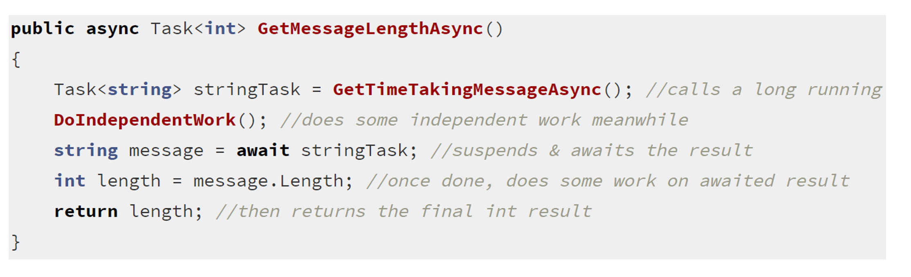
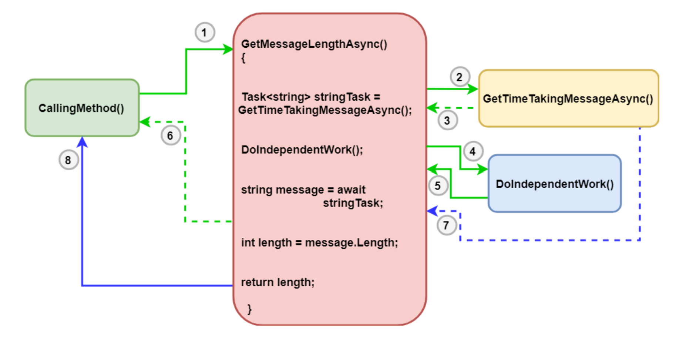

# Async And Await 
* Introduces in **C# 5**
* The code is written like sync programming but doesn't keep **calling thread busy**
* Method Signature is marked **async**
* Method uses **Await**on a **Task** to get result
* Return type i **Task\<T>** or **Task** instead of void
* Method name is suffix with **Async**

## What happens with Awaited Code? 
* First check **work is already complete** 
    * If yes: coe continues executing synchronous code blocks 
    * If No: The current thread **suspends the workflow of the metho, captures the current context and returns from the method to the calling method**
* Current thread continues with other task from calling method. 
* Once that task completes, the **method resumes from the await point on the captured context.**

## Example 

* GetMessageLengthAsync() calls **long running task** GetTimeTakingMessageAsync() and get Task\<string> 
* While async task is running method calls **DoIndependentWork()**
* When execution comes @ await, the metho suspends the current workflow and waits for long-running task to complete asynchronously without **blocking calling thread**

* Now, the thread that originally had called GetMessageLengthAsync(), gets free at this point, leaves the method and gives control back to the original calling location. Once the Task is completed, it continues execution from this point, does some processing dependent on the Task result (int length = message.Length) and finally returns the int result

## Detailed Explanation

1. First an external method, say **CallingMethod()** calls our **GetMessageLengthAsync()** method. Let’s call the thread that makes this call as the **main thread**(the green lines)

2. GetMessageLengthAsync() makes a call to another async method on the same thread, just like any normal code execution
3. Now, this method GetTimeTakingMessageAsync() being an async method, **returns control immediately**, leaving the work of getting message to be done in background
4. Now, GetMessageLengthAsync() continues its execution normally and makes a call to a method called DoIndependentWork() that does not depend on the message result from GetTimeTakingMessageAsync(). This is called **synchronously on the main thread**
5. After DoIndependentWork() completes, control of execution comes back to GetMessageLengthAsync()
6. Now the execution hits the line with the await keyword, which instructs the method to **wait asynchronously (not block) for the message**. At await, the main thread suspends the work on this method, and returns to CallingMethod() where it is free to do other stuff. Just before this,** CLR captures what is called the synchronization context** 
7. At a later point of time, when the message is fully received, the continuation of the rest of the code is invoked. Now **depending on the captured context**, **the rest of the code might run on the same main thread, or another thread**
Finally, the rest of the code is executed and upon completion the final result is returned to CallingMethod()

## Threads in Async Await , CPU-bound & I/O bound 
* **QUESTION 1** Important question is **Is any new threads create for an async process to execute?** Answer is no - but if it requires additional threads they are taken from **managed thread pool**
* **QUESTION 2**--- **When is a thread from thread pool used? if a thread pool thread is not used, how does the async work complete without a thread?** TO answer this we need to different between **two types of work** done async:   
    * **CPU Bound**
        * Work which requires heavy computation. It uses a **dedicated thread from thread pool** 
        * For this await operation is started on a **background thread** with Task.Run method**
        * If a work is appropriate for **concurrency and parallelism** consider using **Task parallel library** 
        > **NOTE** Keep in mind to measure execution of your code, if CPU bound task is *not costly enough** compared with *overhead of context switches when multi-threading**
    * **I/O Bound** - work which depends on outside CPU tasks. It may not need dedicated thread but only **time slices of thread(s) is required** for start/stop/progress notifications
        * For this the await operation return Task or Task\<T> 

## Deep Dive Task and Task\<T> for an I/O-Bound Operation

