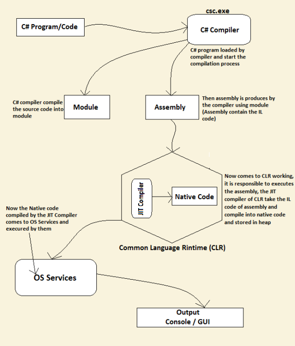
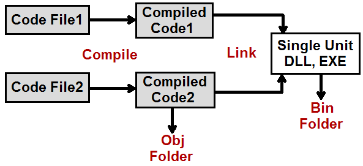

# Compilation Process C# 

* C# compiler compiles source code into **modules** which is finally converted into **assembly**. 
* Assembly contains **IL code along with assembly metadata** 
* CLR works with assembly by **Loading assembly --> converting to native code for execution**
* Native Code is executed by the OS

## Compilation and Linking 

1. **Compilation**: Individual C# Code files are compiled into individual compiled units. These *individual compiled code files* go in the **OBJ directory**. This is for **intermediate object files/Compiled binary files**
2. **Linking**: In this phase, the individual files are **linked to create single unit DLL and EXE**. This goes into **BIN** directory

> **IMPORTANT** Each of these folder is divided into *build* and *debug* folders which corresponds to project build configuration. 

