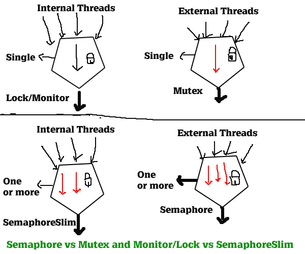

# Thread Safety 
* Using threading we can do multiple tasks simultaneously
* **Thread safety** manipulates shared data structure in a manner that guarantees the **safe execution of a piece of code by multiple threads at same time**

## Example 
* **Scenario**: Let's say we are executing a Division function which has got integer variables and values are assigned by random numbers, Dividing two variables and again resetting their values to 0. Now suppose since we are running this function in a multi-thread environment it could be possible that one thread is dividing and another thread is resetting the value to 0, during this process what happens two thread entered and attacked the variables, variable behavior is un-controllable, it is possible that it will create a dividebyzeroexception error. If its create an error then that means thread is not safe.

## Techniques for thread safety
1. **Semaphore**
2. **Mutex**
3. **Monitor/Lock**
4. **SemaphoreSlim**

## Monitor/Lock 
* Works with **internal threads** generated by application 
* In **multi-threaded** environment it ensures that **only one thread to be executed in a given moment of time and other threads have to wait till the entered thread completes it work**

## Mutex 
* It works with **external threads**. 
* Like monitor mutex works with single thread only. 
* mutex allows only one thread to enter at a time and waits other threads. Other threads needs to wait in a queue till entered thread completes its work. Once entered thread finishes its work then mutex access another queued thread to enter.
* To apply mutext in a class we need to use Mutext class
> Mutex ObjMutext = new Mutex(true, "demo-snippet");

## Semaphore
* Just advance version of mutex. 
* It also helps to identify an application is acquired by an external thread or not.
*  Semaphore allows one or more threads to enter a same moment of time to process work with thread safety. In semaphore we have a feature to limit those no of threads to enter.

## SemaphoreSlim