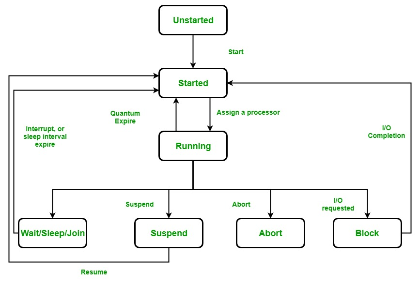
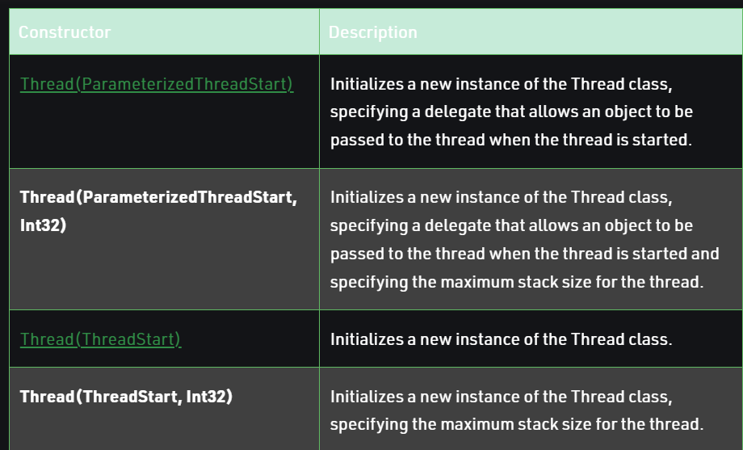

# Threads
* A thread is a an **execution context** which is **all information CPU needs to execute a stream of instructions**
* An Execution context(therefore a thread) consists of **values of the CPU register**
* **Real Life Example**: Suppose you are reading book and want to take a break now, but you want to be able to come back and resume reading from exact point. So you may jot down page number, line number and word number. so even if your friend wants to read from that point they can use this number. These 3 numbers becomes your execution context. 
* CPU spends a bit of time on each computation and this way due to execution context **many task can share the CPU**
*  A thread is a context of execution, while a process is a bunch of resources associated with a computation. A process can have one or many threads.
[`Futher detailed explanation here`](https://stackoverflow.com/a/38145183)
 
* In C# multi-threading system is built upon the Thread Class which **execution of threads**. It is defined under **System.Threading**

### LifeCycle of thread 

1. **UnStarted** - A thread has just been created and **Start()** method is not called on the thread. 
2. **Runnable State**: Thread is ready to run at any instance or might be running actually. It is the responsibility of the thread scheduler to give the thread, time to run. Or in other words, the Start() method is called. 
3. **Running State**: Thread is running **it gets the processor.**
4. **Not Runnable State**: A thread that is not executable because
    * Sleep() method is called.
    * Wait() method is called.
    * Due to I/O request.
    * Suspend() method is called.
5. **Dead State**: When the thread completes its task, then thread enters into dead, terminates, abort state.

### Thread class 
* It is used to **create threads** as well as **create background and foreground threads**
* Allows us to set **priority of threads** and provides **Current state of thread**
* It also provides **reference of currency executing thread**
*   It's a **sealed class**

#### Thread constructor

* See example *ThreadConstructor.cs*

### Foreground and background threads
* A managed thread is either background or foreground thread. 
* Both threads are identical **except background thread doesnt keep the managed execution environment running.**
* Once all foreground threads are stopped in managed process(where exe file is a manahed assembly), the **system stops all background threads** and shuts down. 
*  Use **Thread.IsBackground** to see if it is background thread or change it at any point of time to back ground thread. 
* Unhaandled exceptions in both types of threads **results in termination of application**
* Threads **belonging to managed thread pool**(IsThreadPoolThread property is **true**) are **background threads**
* All threads created by *8starting a new thread* are by default **foreground thread**

### ThreadStaticAttribute
* Indicates that the value of a static field is unique for each thread. 
* See [`code example here`](https://docs.microsoft.com/en-us/dotnet/api/system.threadstaticattribute?view=net-5.0#examples)

### Joining threads
* Join() makes **one thread wait untill another thread completes it's execution**
* If t is a Thread object whose thread is currently executing, then t.Join() causes the current thread to pause its execution until thread it joins completes its execution.
* There are below **3 overloads of join methods**
    * **Join() method**
    * **Join(Int32)**
    * **Join(Timespan)**
* The calling thread will be blocked for an indefinite period of time if the thread which has called Join() method does not terminate.

 
 
 
 

#### Thread Class Properties
1. **ApartmentState**: Gets or sets the apartment state of this thread.
2. **CurrentContext**: 	Gets the current context in which the thread is executing.
3. **CurrentCulture**:	Gets or sets the culture for the current thread.
4. **CurrentPrincipal**: Gets or sets the thread’s current principal (for role-based security).
5. **CurrentThread**:	Gets the currently running thread.
6. **CurrentUICulture**:	Gets or sets the current culture used by the Resource Manager to look up culture-specific resources at run time.
7. **ExecutionContext**:	Gets an ExecutionContext object that contains information about the various contexts of the current thread.
8. **IsAlive**:	Gets a value indicating the execution status of the current thread.
9. **IsBackground**:	Gets or sets a value indicating whether or not a thread is a background
10. **IsThreadPoolThread**:	Gets a value indicating whether or not a thread belongs to the managed thread pool.
11. **ManagedThreadId**:	Gets a unique identifier for the current managed thread.
12. **Name**:	Gets or sets the name of the thread.
13. **Priority**:	Gets or sets a value indicating the scheduling priority of a thread.
14. **ThreadState**:	Gets a value containing the states of the current thread.
> Example : See ThreadPropertiesExample.cs

#### Thread Class Methods
1. **Abort()**:	Raises a **ThreadAbortException** in the thread on which it is invoked, to begin the process of terminating the thread. Calling this method usually terminates the thread.

2. **AllocateDataSlot()**:	Allocates an **unnamed data slot on all the threads**. For better performance, use fields that are marked with the ThreadStaticAttribute attribute instead.

3. **AllocateNamedDataSlot(String)**:	Allocates a **named data slot on all threads**. For better performance, use fields that are marked with the ThreadStaticAttribute attribute instead.

4. **BeginCriticalRegion()**:	Notifies a host that execution is about to enter a region of code in which the effects of a thread abort or unhandled exception might jeopardize other tasks in the application domain.

5. **BeginThreadAffinity()**:	Notifies a host that managed code is about to execute instructions that depend on the identity of the current physical operating system thread.

6. **DisableComObjectEagerCleanup()**:	**Turns off automatic cleanup of runtime callable wrappers (RCW)** for the current thread.

7. **EndCriticalRegion()**:	Notifies a host that execution is about to enter a region of code in which the effects of a thread abort or unhandled exception are limited to the current task.

8. **EndThreadAffinity()**	Notifies a host that managed code has finished executing instructions that depend on the identity of the current physical operating system thread.

9. **Equals(Object)**	Determines whether the specified object is equal to the current object.

10. **Finalize()**:	Ensures that resources are freed and other cleanup operations are performed when the garbage collector reclaims the Thread object.

11. **FreeNamedDataSlot(String)**:	Eliminates the association between a name and a slot, for all threads in the process. For better performance, use fields that are marked with the ThreadStaticAttribute attribute instead.

12. **GetApartmentState()**: Returns an ApartmentState value indicating the apartment state.
14. **GetCompressedStack()**:	Returns a CompressedStack object that can be used to capture the stack for the current thread.

15. **GetData(LocalDataStoreSlot)**:	Retrieves the value from the specified slot on the current thread, within the current thread’s current domain. For better performance, use fields that are marked with the ThreadStaticAttribute attribute instead.

16. **GetDomain()**: Returns the current domain in which the current thread is running.
17. **GetDomainID()**:	Returns a unique application domain identifier.
18. **GetHashCode()**:	Returns a hash code for the current thread.
19. **GetNamedDataSlot(String)**:	Looks up a named data slot. For better performance, use fields that are marked with the ThreadStaticAttribute attribute instead.
20. **GetType()**:	Gets the Type of the current instance.
21. **Interrupt()**:	Interrupts a thread that is in the WaitSleepJoin thread state.
22. **Join()**:	Blocks the calling thread until the thread represented by this instance terminates, while continuing to perform standard COM and SendMessage pumping.
23. **MemberwiseClone()**:	Creates a shallow copy of the current Object.
24. **MemoryBarrier()**:	Synchronizes memory access as follows: The processor executing the current thread cannot reorder instructions in such a way that memory accesses prior to the call to MemoryBarrier() execute after memory accesses that follow the call to MemoryBarrier().
25. **ResetAbort()**:	Cancels an Abort(Object) requested for the current thread.
26. **Resume()**:	Resumes a thread that has been suspended.
27. **SetApartmentState(ApartmentState)**:	Sets the apartment state of a thread before it is started.
28. **SetCompressedStack(CompressedStack)**:	Applies a captured CompressedStack to the current thread.
29. **SetData(LocalDataStoreSlot, Object)**:	Sets the data in the specified slot on the currently running thread, for that thread’s current domain. For better performance, use fields marked with the ThreadStaticAttribute attribute instead.
30. **Sleep()**:	Suspends the current thread for the specified amount of time.
SpinWait(Int32)	Causes a thread to wait the number of times defined by the iterations parameter.
31. **Start()**	Causes a thread to be scheduled for execution.
32. **Suspend()**:	Either suspends the thread, or if the thread is already suspended, has no effect.
33. **TrySetApartmentState(ApartmentState)**:	Sets the apartment state of a thread before it is started.
34. **VolatileRead()**:	Reads the value of a field. The value is the latest written by any processor in a computer, regardless of the number of processors or the state of processor cache.
35. **VolatileWrite()**:	Writes a value to a field immediately, so that the value is visible to all processors in the computer.
36. **Yield()**:	Causes the calling thread to yield execution to another thread that is ready to run on the current processor. The operating system selects the thread to yield to.

> See example ThreadMethodExample.cs