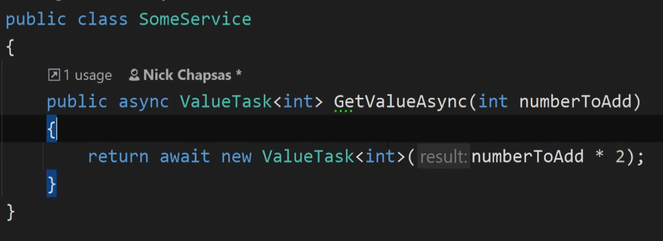
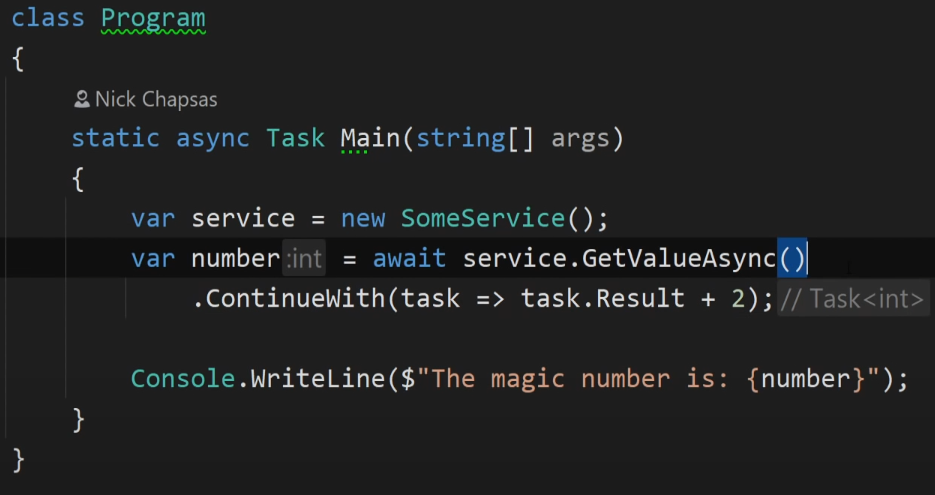

# Async and Await 
[`David Fowler Async Coding Guidlines click here`](https://github.com/davidfowl/AspNetCoreDiagnosticScenarios/blob/master/AsyncGuidance.md)
[`Async await best practises click here`](https://docs.microsoft.com/en-us/archive/msdn-magazine/2013/march/async-await-best-practices-in-asynchronous-programming)

* Async keyword only enables await keyword in a method)and manages the method result)
* Async method is executed normally unitll await is hit or an exception is thrown
* Await is **unary operatoer** which takes any **awaitable** and see if it has already completed; if so then method continues synchronously. 
* If method has not completed then await acts aysnchronously and asks method to complete and then return \
* Some common awaitables are Task, Task<T> and Task.Yeild
* **Return Types**: Task<T>, Task, or void. 

### Common Async Await Mistakes 
1. **Once Async, Always Async** : Once your project has async call await it all the way. Don't synchronize the call. Like in Main method if you have async code dont use GetValueAsync rather make main method async. **Maintain async top to bottom**
2. **Async Void is Bad**: If for some reason your method throws an exception and you are returning void, it would return **fatal exception** and make **whole process to crash and your application stop** . Alt solution is to use Task.Run() and call the method from here but it wont throw an exception as it is fire and forget but to get exception is a possibility .
3. **Prefer Task.FromResult over Task.Run**: As it will waste a thread pool thread, where as FromResult wont waste any resource. You can also use **ValueTask** which was introduced in C#  which is more memory efficient. 

4. **Sync over Async**: Sync over async(using GetAwaiter().Result) causes deadlock but this is fixed in .net core as it doesnt have synchronization context which was causing problem. It will result in use of 2 threads instead of one so potential resource consumption and thread pool starvation are the issue, 
5. **Prefer Await over ContinueWith**: Some people use COntinueWith fire and forget but we should not do this. 

6. **Always pass cancellation token**: Every controller method can have cancellation token parameter which can be passed down to the subsequent calls which is automatically populated. .NET Core will notify when the request will be cancelled. 
7. **Prefer Async Task Over Task**: When you are using await aysnc, the synchronous exceptions are normalized to be asynchronous. 
8. **Don't Sync over Async in constructors**: Dont synchronize the call inside constructor also it wil consume more threads. 

### ConfiureAwait
* ConfigureAwait(false) tells await that you do not need to resume on the current context. however for the rest of async method, you cannot do anything that assumes you're in current context. 

### Context 
* [`read more`](https://blog.stephencleary.com/2012/02/async-and-await.html)