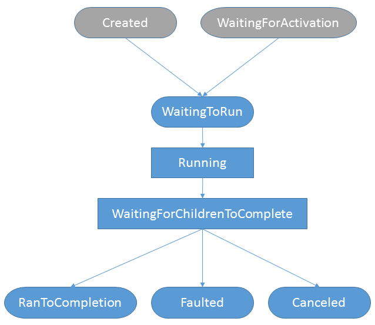
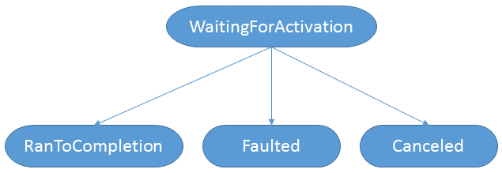
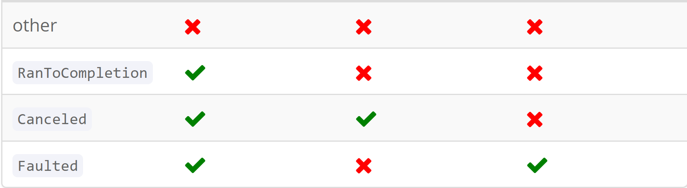

# Task
* There are **TWO TYPES OF TASK**
    1. **Delegate Task aka Code based Task**: Task that has _code to run_. In TPL most task were delegate tasks. 
    2. **Promise Task aka Promise based Task**: Task that represents some kind of _event or signal_. In _async_ most tasks are promise task as when code does an _await there is not thread beign tied up waiting. Often they are I/O-based signals(eg HTTP Download complete), it can be anything like 10 second timer expired

### LifeCycle of a Task 
> TaskStatus Status {get;}

* If you view Task as _state machine_ then status represents the current state. 
* diff tasks takes diff paths through the state machine

 #### Delegate Task 
 
 * Usually it is created via Task.Run (or Task.Factory.StartNew) and enter state machine at __WaitingToRun__
 > **EXCEPTIONS**
 If a DT is started via task constructer then it goes ot __Created__ and goes to __WaitingToRun__ when we assign it to a __task scheduler via Start or RunSynchronously__
> 
> If DT is continuation of another task, then it starts in the __WaitingForActivation__ and movies to __WaitingToRun__ when other task completes

* DT would finally end in one of three final states: **RanToCompletion, Faulted or Canceled**


#### Promise Tasks 
* It has much simpler state machine

* Technically PT can also enter **WaitingForChildrenToComplete**, this is non-intuitive and for this reason __tasks created for async usually specify the __DenyChildAttach__ flag__
* A PT may end up in RanToCompletion without even actually running. 
* In Progress state is actually called **WaitingForActivation**. So All PT are created ***HOT*** meaning that the operation is in progress

#### Status Properties 
* Task has few convenience properties for determining the final state: 
> 1. bool IsCompleted {get;}
> 2. bool IsCanceled {get;}
> 3. bool IsFaulted {get;}

> NOTE: ISCompleted doesnt map to RanToCompletion but it is true if task is in any final state. 



### ID
> int Id {get;}

* Identifiers are unique, they are generated on demand and will not be zero. 
* it can be useful for debugging purposes or reading ETW events in TPL

#### CurrentId
> static int? CurrentId {get;}

* Returns the identifier of the currently executing task, or null if no task is executing. This only **works for DT and not PromiseTasks**


### Starting 
* When a task is created using constructor, it's in **Created** state. This is **Holding State** where task wont do anything untill it is started. 
> void Start()
> void Start(TaskScheduler)

> void RunSynchronously()
> void RunSynchronously()

### Waiting

* There are variety of ways that code can block on a task. All of these options block the calling thread until the task completes, so they’re almost **never used with Promise Tasks**. 
>**Note** that blocking on a Promise Task is a **common cause of deadlocks**;

* blocking is almost exclusively used with Delegate Tasks (i.e., a task returned from Task.Run).

* There are below 5 overloads of Wait Method: 
> void Wait();
void Wait(CancellationToken);
bool Wait(int);
bool Wait(TimeSpan);
bool Wait(int, CancellationToken);

* Wait : **blocks the calling thread** untill the task completes, a timeout occours or wait is cancelled. 
* On **Wait Cancellation** Wait raises **OperationCanceledException**
* On **Wait Timeout** wait returns **false**
* Task.Wait has **deadlock potential** it may be used in current context. Like if Main method has some async work to do but want main thread to run synchronously. 

#### WaitAll 
* This will wait for multiple tasks to all complete. 
* This should be very rarely used. 
> **NOTE** When writing parallel code developers should **first attempt data parallelism** even if task parallelism is nessesary. 

#### WaitAny
* It only waits for first task to complete **and returns the index of that task**
* It **wont propagate that task's exception in an *AggregateEXception(WHich wraps OperationCancelledException)***. Any failures need to be checked after WaitAny returns. 
* It returns **-1** on timeout and throw OCException when cancelled. 


#### AsyncWait Handle
* The Task type actually implements IAsyncResult for easy interoperation with the (unfortunately named) Asynchronous Programming Model (APM). This means Task has a wait handle as one of its properties:

> WaitHandle IAsyncResult.AsyncWaitHandle { get; }

> Note that this member is explicitly implemented, so consuming code must cast the Task as IAsyncResult before reading it. The actual underlying wait handle is lazy-allocated.

### Task.Run
* Queues the specified work to run on the ThreadPool and returns a task or Task<TResult> handle for that work. It's not advisible to use this as it consumes an extra thread from thread pool. 

### Results 
* Consuming code must retriev results from task even if task has no result, it's **important for consuimg code to examine task for errors** to know if task completed successfully or failed. 
* It only **exists on Task<T>** type as 
> T Result {get;}

* Like Wait, Reuslt will **synchronously block the calling thread untill the task completes**
* Result will wrap any **task exceptions in AggregateException**

#### GetAwaiter().GetResult()
* It is just used by **await** but we can also call it. 
* using this the code wi;; **synchronously block** untill the task completes. 

#### Await 
* It's not a member of task type. 
* await will **asynchronously wait(not block)** and will **(re-)throw exceptions for failed tasks without wrapping in an AggregateException**

### Continuations 
* A continuation is a **delegate** which you can attach to your task and tell the task **to run this when you're done** 
* Such a task is also called **antecedent** task. 
* It is the essence of asynchrony, and the async/await system uses continuations whenever it deals with tasks.

#### ContinueWith
* It's most low-level way to attach continuations to a task. 
* Two primary continuation delegates that can be passed to it is: 
    * One has result value **Func<...>**
    * one had no result value **Action<...>**
* It **retuns a task** itself representing continuation. 
* task.ContinueWith(t => ...); here task and t refer to same **antecedent task instance**

> **IMPORTANT** It's not recommended using ContinueWith at all; unless you are doign **[`dynamic task parallelism`](https://docs.microsoft.com/en-us/previous-versions/msp-n-p/ff963551(v=pandp.10)?redirectedfrom=MSDN)** which is extremely rare

#### Task.WhenAll
* it returns a task that completes when all of the antecedent tasks have completed. 
* it's similar to TaskFactory.ContinueWhenAll but works more nicely with await 
```
var client = new HttpClient();
string[] results = await Task.WhenAll(
    client.GetStringAsync("http://example.com"),
    client.GetStringAsync("http://microsoft.com"));
// results[0] has the HTML of example.com
// results[1] has the HTML of microsoft.com
```
* It can also be used with LINQ 
```
IEnumerable<string> urls = ...;
var client = new HttpClient();
string[] results = await Task.WhenAll(urls.Select(url => client.GetStringAsync(url)));
```


#### Task.WhenAny
* Instead of waiting for all antecedent tasks to complete it just waits for one. 
* WhenAny **returns** when any of antecedent tasks complete. The result of that task is the antecedent task that is completed. 
* This lets us see which tasks completes faster out of set of tasks 
```
var client = new HttpClient();
Task<string> downloadExampleTask = client.GetStringAsync("http://example.com");
Task<string> downloadMicrosoftTask = client.GetStringAsync("http://microsoft.com");
Task completedTask = await Task.WhenAny(downloadExampleTask, downloadMicrosoftTask);
if (completedTask == downloadExampleTask)
  ; // example.com downloaded faster.
```

```
var client = new HttpClient();
Task<string> firstDownloadToComplete = await Task.WhenAny(
    client.GetStringAsync("http://example.com"),
    client.GetStringAsync("http://microsoft.com"));
string results = await firstDownloadToComplete; 
// results contains the HTML for whichever website responded first.
```
> **NOTE** when you use WhenAny, you actually don’t care about the tasks that don’t complete first.